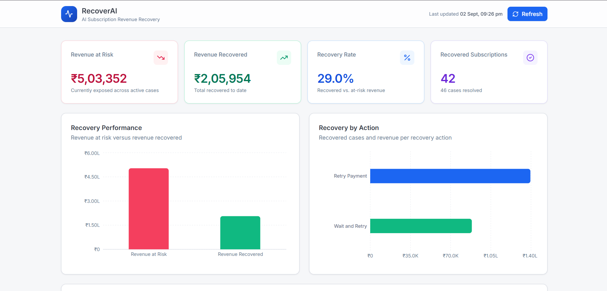
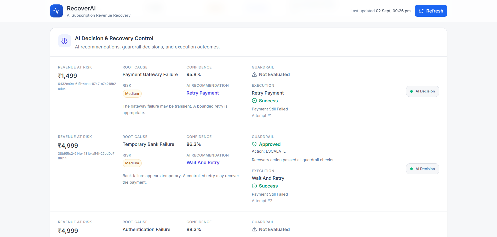
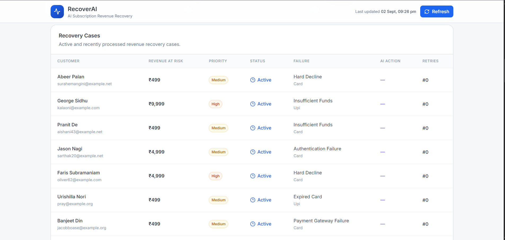
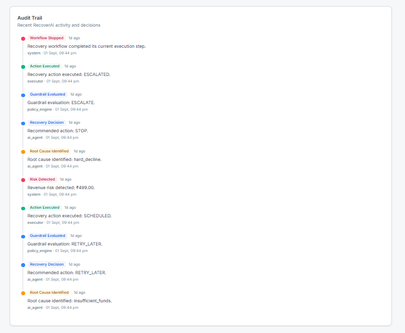
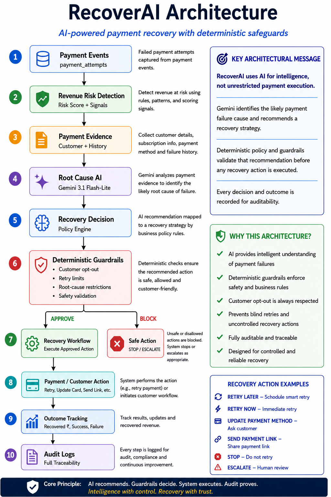

# 🚀 RecoverAI — AI Subscription Revenue Recovery Agent

RecoverAI is an AI-powered subscription revenue recovery system designed to help businesses recover recurring revenue from failed payments.

It detects revenue at risk, analyzes payment failures using Gemini AI, recommends a recovery strategy, validates that recommendation with deterministic business guardrails, executes only approved actions, tracks the outcome, and records an auditable history.

> **AI recommends. Guardrails decide. System executes. Audit proves.**

---

## 🎯 Problem

Subscription businesses can lose recurring revenue when payments fail because of:

- Insufficient funds
- Expired cards
- Soft declines
- Hard declines
- Temporary bank failures
- Payment gateway failures
- Authentication failures

A simple retry system often treats different payment failures in the same way.

This can cause:

- Unnecessary payment retries
- Poor customer experience
- Repeated attempts on unrecoverable failures
- Ignoring customer opt-out preferences
- Manual work for payment operations teams
- Revenue remaining unnecessarily at risk

The key problem is not simply **"how do we retry a failed payment?"**

It is:

> **"What is the likely reason for this failure, what recovery action has the best chance of working, and is that action actually safe and allowed?"**

---

# 💡 Solution

RecoverAI combines AI reasoning with deterministic business logic.

```text
Payment Events
      ↓
Revenue Risk Detection
      ↓
Payment Evidence Builder
      ↓
Gemini AI Root Cause Analysis
      ↓
Recovery Policy Recommendation
      ↓
Deterministic Guardrails
      ↓
Recovery Workflow Executor
      ↓
Outcome Tracking
      ↓
Audit Logs
```

The AI is responsible for understanding the payment situation and recommending a strategy.

The deterministic application layer is responsible for deciding whether that recommendation is allowed to execute.

This separation makes the system adaptive without allowing the LLM to directly control payment execution.

---

# 🤖 Why AI?

Different payment failures require different recovery strategies.

| Failure situation | Typical recovery strategy |
|---|---|
| Soft decline | Retry now |
| Insufficient funds | Retry later |
| Expired card | Request payment-method update |
| Authentication failure | Send payment link |
| Hard decline | Escalate or stop |
| Temporary bank failure | Retry later or escalate |
| Payment gateway failure | Retry or escalate depending on evidence |

RecoverAI uses Gemini to analyze payment evidence and produce structured information such as:

- Root cause
- Failure type
- Recovery probability
- Confidence
- Recovery recommendation

The recommendation is then validated before it can influence the workflow.

---

# 🧠 AI Prompting Strategy

RecoverAI uses **structured and constrained prompting** rather than asking the model for an unrestricted text response.

The AI receives relevant payment evidence, including information such as:

- Payment failure reason
- Decline code
- Payment method
- Attempt history
- Attempt number
- Subscription context
- Revenue at risk
- Recovery context

Gemini analyzes this evidence and returns structured output.

```text
Payment Evidence
      ↓
Gemini Prompt
      ↓
Root Cause
Failure Type
Recovery Probability
Confidence
Recommendation
      ↓
Structured Validation
      ↓
Recovery Policy
```

The system validates the AI output using Pydantic before allowing it to continue through the recovery workflow.

> **Gemini recommends; deterministic application logic decides whether the recommendation is allowed to execute.**

---

# 🛡️ AI + Deterministic Guardrails

RecoverAI does **not** allow the LLM to directly execute payment actions.

```text
                 Gemini AI
                     ↓
              Recommendation
                     ↓
        Deterministic Guardrails
                     ↓
              ┌──────┴──────┐
              ↓             ↓
           APPROVE         BLOCK
              ↓             ↓
      Execute Action   STOP / ESCALATE
```

Guardrails enforce rules such as:

- Customer opt-out
- Maximum retry limits
- Root-cause restrictions
- Hard-decline restrictions
- Recovery safety rules
- Action validation

### Example

```text
AI Recommendation:
RETRY_NOW

Customer:
opted_out = true

        ↓

Guardrail:
BLOCK

        ↓

Final Action:
STOP

        ↓

Payment:
NOT ATTEMPTED
```

This is one of the core safety properties of RecoverAI: **the AI can recommend an action, but it cannot bypass deterministic business rules.**

---

# 🧠 Root Cause Analysis

RecoverAI currently supports these root causes:

```text
expired_card
insufficient_funds
temporary_bank_failure
payment_gateway_failure
hard_decline
soft_decline
authentication_failure
```

Failure types are also classified into controlled categories such as:

```text
SOFT_DECLINE
HARD_DECLINE
TECHNICAL_FAILURE
AUTHENTICATION_FAILURE
CUSTOMER_PAYMENT_METHOD
UNKNOWN
```

The AI output is validated using Pydantic.

Invalid root causes, failure types, probabilities, or confidence values are rejected before they can influence recovery execution.

```text
Invalid AI Output
       ↓
Validation Failed
       ↓
Output Rejected
       ↓
Recovery Action Not Executed
```

---

# ⚙️ Recovery Actions

RecoverAI currently supports:

```text
RETRY_NOW
RETRY_LATER
UPDATE_PAYMENT_METHOD
SEND_PAYMENT_LINK
SEND_REMINDER
ESCALATE
STOP
```

### RETRY_NOW

Used when the failure appears potentially recoverable immediately.

```text
soft_decline
     ↓
RETRY_NOW
     ↓
Payment Retry
```

### RETRY_LATER

Used when the failure may resolve with time.

```text
insufficient_funds
     ↓
RETRY_LATER
     ↓
Retry Scheduled
```

### UPDATE_PAYMENT_METHOD

Used when the customer's payment method needs to be changed.

```text
expired_card
     ↓
UPDATE_PAYMENT_METHOD
     ↓
Customer Action Required
```

### SEND_PAYMENT_LINK

Used when the customer needs a payment/authentication flow.

```text
authentication_failure
     ↓
SEND_PAYMENT_LINK
     ↓
Customer Completes Payment
```

### ESCALATE

Used when automatic recovery is unsafe or inappropriate.

```text
hard_decline
     ↓
ESCALATE
     ↓
Human Review
```

### STOP

Used when recovery should not continue, including cases where customer preferences or safety rules require the workflow to stop.

---

# 👤 Customer Opt-Out Protection

Customer preferences are enforced outside the AI.

The customer record contains an `opted_out` flag.

When:

```text
customer.opted_out = true
```

a recovery action can be blocked even when the AI recommends an action.

```text
AI:
RETRY_NOW

        ↓

Guardrail:
Customer has opted out

        ↓

STOP

        ↓

Payment NOT ATTEMPTED
```

This prevents customer-protection rules from depending on the LLM.

---

# 🔍 Revenue Risk Detection

The risk detector identifies active subscriptions with failed payment attempts and calculates a risk score using deterministic signals.

Current scoring signals include:

```text
Base risk                 +40
Repeated failures        +20
Retry exhaustion         +20
High-value subscription  +20
                          ----
Maximum                  100
```

Severity is determined from the score:

```text
90+  → CRITICAL
70+  → HIGH
40+  → MEDIUM
<40  → LOW
```

RecoverAI also prevents already-recovered subscriptions from continuing to appear as active revenue risk when a successful payment occurs after the triggering failure.

This avoids repeatedly processing revenue that has already been recovered.

---

# 📉 Payment Degradation Detection

RecoverAI can identify payment-method degradation by comparing failure performance across payment methods.

A degradation threshold is used to identify meaningful changes rather than reacting to normal variation.

The dashboard exposes:

- Degraded payment methods
- Affected subscriptions
- Revenue at risk

Example:

```text
Payment Method
      ↓
Failure-rate comparison
      ↓
Degradation detected
      ↓
Affected subscriptions
      ↓
Revenue at risk
```

This gives the system an operational signal in addition to individual payment-level risk detection.

---

# 🔄 Recovery Pipeline

The complete recovery workflow is:

```text
1. Detect revenue risk
          ↓
2. Collect payment evidence
          ↓
3. Analyze root cause with Gemini
          ↓
4. Generate recovery recommendation
          ↓
5. Validate AI output
          ↓
6. Apply deterministic guardrails
          ↓
7. Execute approved action
          ↓
8. Track outcome
          ↓
9. Record audit events
```

The pipeline can process multiple recovery cases and can also be targeted to a specific subscription during testing.

---

# 📊 Dashboard

RecoverAI includes a dashboard for monitoring both business outcomes and AI decision control.

The dashboard provides visibility into:

- Revenue at risk
- Revenue recovered
- Recovery rate
- Recovered subscriptions and cases
- Recovery by action
- Operational case status
- Payment-method degradation
- AI recommendation distribution
- Recovery cases
- AI decision and guardrail control
- Recent audit events

## Dashboard Screenshots

### 1. Dashboard Overview

> **Screenshot:** Add the main dashboard screenshot here.

```text
docs/screenshots/dashboard-overview.png
```



### 2. AI Decision & Recovery Control

> **Screenshot:** Add a screenshot showing AI recommendation, confidence, guardrail approval/blocking, and execution status here.

```text
docs/screenshots/ai-decision-control.png
```



### 3. Recovery Cases

> **Screenshot:** Add a screenshot showing recovery cases, revenue at risk, priority, failure reason, payment method, AI action, and retry count here.

```text
docs/screenshots/recovery-cases.png
```



### 4. Audit Trail

> **Screenshot:** Add a screenshot showing the recent recovery workflow events here.

```text
docs/screenshots/audit-trail.png
```



> **Tip:** If you only want to include one or two screenshots in the final submission, use the **Dashboard Overview** and **AI Decision & Guardrail Control** screenshots because they communicate the product and its AI-safety architecture most clearly.

---

# 📈 Recovery Metrics

RecoverAI tracks business-level metrics including:

- Cases processed
- Revenue at risk
- Revenue recovered
- Recovery rate
- Successful recoveries
- Recovered subscriptions
- AI recommendations by action
- Executed actions by action
- Revenue recovered by action

The dashboard calculates these values dynamically from the database and recovery workflow rather than relying on hardcoded demo values.

Example metric flow:

```text
Recovery Cases
      ↓
Recovery Actions
      ↓
Successful Outcomes
      ↓
Revenue Recovered
      ↓
Dashboard Metrics
```

---

# 🧾 Auditability

RecoverAI records important workflow events including:

```text
risk_detected
root_cause_identified
recovery_decision
guardrail_evaluated
action_executed
workflow_stopped
```

This creates a traceable history of what happened during recovery.

```text
Risk Detected
      ↓
Root Cause Identified
      ↓
AI Recommendation
      ↓
Guardrail Evaluation
      ↓
Action Execution
      ↓
Outcome
      ↓
Audit Log
```

The audit trail is especially important when AI is involved in operational decision-making.

---

# 🧪 Testing

RecoverAI has been tested across multiple recovery scenarios.

### Core tests

- ✅ Revenue risk detection
- ✅ Successful-payment exclusion
- ✅ Root-cause analysis
- ✅ Structured AI output
- ✅ Invalid root-cause rejection
- ✅ Invalid failure-type rejection
- ✅ Invalid recovery-probability rejection
- ✅ Invalid-confidence rejection
- ✅ Recovery policy decisions
- ✅ Customer opt-out protection
- ✅ Retry limits
- ✅ Hard-decline handling
- ✅ Expired-card handling
- ✅ Temporary-failure handling
- ✅ Successful payment recovery
- ✅ Recovery-case closure
- ✅ Audit logging
- ✅ Batch processing
- ✅ Recovery metrics
- ✅ Payment degradation detection
- ✅ Dashboard API
- ✅ Recovery-case visibility
- ✅ AI recommendation distribution

### Example recovery flow test

```text
Failed Payment
      ↓
Soft Decline
      ↓
AI: RETRY_NOW
      ↓
Guardrail: APPROVED
      ↓
Retry Executed
      ↓
Payment SUCCESS
      ↓
Revenue Recovered
      ↓
Recovery Case CLOSED
```

### Opt-out test

```text
Failed Payment
      ↓
AI: RETRY_NOW
      ↓
Customer opted_out = true
      ↓
Guardrail: BLOCKED
      ↓
Action: STOP
      ↓
Payment NOT ATTEMPTED
```

---

# 🏗️ Architecture

The high-level architecture is:

```text
                         ┌──────────────────────┐
                         │    Payment Events    │
                         │   payment_attempts   │
                         └──────────┬───────────┘
                                    ↓
                         ┌──────────────────────┐
                         │  Revenue Risk        │
                         │     Detection        │
                         └──────────┬───────────┘
                                    ↓
                         ┌──────────────────────┐
                         │  Payment Evidence    │
                         │ Customer + History   │
                         └──────────┬───────────┘
                                    ↓
                         ┌──────────────────────┐
                         │     Gemini AI        │
                         │   Root Cause +       │
                         │   Recommendation     │
                         └──────────┬───────────┘
                                    ↓
                         ┌──────────────────────┐
                         │  Recovery Policy     │
                         │     Decision         │
                         └──────────┬───────────┘
                                    ↓
                    ┌──────────────────────────────┐
                    │    Deterministic Guardrails  │
                    │                              │
                    │ • Customer opt-out           │
                    │ • Retry limits               │
                    │ • Root-cause restrictions    │
                    │ • Safety validation          │
                    └──────────────┬───────────────┘
                                   │
                         ┌─────────┴─────────┐
                         ↓                   ↓
                      APPROVE              BLOCK
                         ↓                   ↓
                Recovery Workflow       STOP / ESCALATE
                         ↓
                Outcome Tracking
                         ↓
                    Audit Logs
```

## Architecture Diagram

For the final submission, add a visual architecture diagram here:

```text
docs/architecture.png
```



The visual diagram should highlight the separation between:

**AI reasoning → deterministic guardrails → controlled execution → auditability**

---

# 🗄️ Data Model

The backend uses PostgreSQL.

Core entities include:

```text
customers
subscriptions
payment_attempts
recovery_cases
recovery_actions
agent_decisions
audit_logs
```

Relationships:

```text
Customer
   │
   └── Subscriptions
          │
          ├── Payment Attempts
          │
          └── Recovery Cases
                 │
                 ├── Recovery Actions
                 ├── Agent Decisions
                 └── Audit Logs
```

---

# 🛠️ Technology Stack

## Backend

- Python
- FastAPI
- PostgreSQL
- Psycopg
- Pydantic

## AI

- Google Gemini API
- Gemini 3.1 Flash-Lite
- Structured AI output

## Frontend

- React
- Vite
- TypeScript
- Tailwind CSS
- Recharts
- Lucide React

## Configuration

- Python dotenv

## Architecture

- Revenue risk detection
- Payment evidence building
- AI root-cause analysis
- Recovery policy engine
- Deterministic guardrails
- Recovery workflow execution
- Outcome tracking
- Audit logging
- Payment degradation detection
- Dashboard analytics

---

# 📁 Project Structure

The project is organized around the recovery lifecycle:

```text
recover-ai/
│
├── backend/
│   ├── app/
│   │   ├── main.py
│   │   ├── dashboard_repository.py
│   │   ├── risk_detection.py
│   │   ├── root_cause_analysis.py
│   │   ├── recovery_policy.py
│   │   ├── guardrails.py
│   │   ├── recovery_workflow.py
│   │   ├── recovery_pipeline.py
│   │   └── ...
│   │
│   ├── tests/
│   ├── schema/
│   ├── .env
│   └── requirements.txt
│
├── frontend/
│   ├── src/
│   │   ├── components/
│   │   ├── pages/
│   │   ├── api.ts
│   │   └── types/
│   ├── package.json
│   └── ...
│
├── docs/
│   ├── screenshots/
│   │   ├── dashboard-overview.png
│   │   ├── ai-decision-control.png
│   │   ├── recovery-cases.png
│   │   └── audit-trail.png
│   └── architecture.png
│
└── README.md
```

---

# ▶️ Running RecoverAI

## 1. Clone the repository

```bash
git clone <your-repository-url>
cd recover-ai
```

## 2. Start the backend

Windows PowerShell:

```powershell
cd backend
.venv\Scripts\Activate.ps1
```

Configure the required environment variables in `.env`.

Example:

```env
GEMINI_API_KEY=your_gemini_api_key
DATABASE_URL=your_database_connection_string
```

**Never commit API keys or database credentials to Git.**

Start the FastAPI server:

```powershell
uvicorn app.main:app --reload
```

The backend API will be available at:

```text
http://127.0.0.1:8000
```

The dashboard API is available at:

```text
http://127.0.0.1:8000/dashboard
```

## 3. Start the frontend

Open another PowerShell terminal:

```powershell
cd frontend
npm install
npm run dev
```

Open the Vite development URL shown in the terminal.

## 4. Run tests

```powershell
cd backend
pytest -v
```

## 5. Build the frontend

```powershell
cd frontend
npm run build
```

---

# 🔐 Safety Principles

RecoverAI follows these principles:

1. **AI does not directly execute payments.**
2. **AI output is structurally validated.**
3. **Recovery actions pass through deterministic guardrails.**
4. **Customer opt-out is respected.**
5. **Retry limits prevent uncontrolled retries.**
6. **Hard declines can be escalated instead of blindly retried.**
7. **Recovery outcomes are recorded.**
8. **Important workflow events are auditable.**
9. **Already-recovered revenue is removed from active risk detection.**

These principles make the system safer than an LLM-driven workflow where the model has direct execution authority.

---

# 🏆 Core Differentiator

RecoverAI is not simply an LLM connected to a payment API.

It combines:

```text
AI Intelligence
       +
Payment Evidence
       +
Deterministic Business Rules
       +
Customer Protection
       +
Controlled Execution
       +
Outcome Tracking
       +
Auditability
```

The important design decision is the separation of responsibilities:

```text
Gemini
  ↓
Understands the situation
  ↓
Recommends a recovery strategy
  ↓
Deterministic Policy + Guardrails
  ↓
Decides whether the action is allowed
  ↓
Workflow Executor
  ↓
Performs only the approved action
  ↓
Audit Logs
  ↓
Proves what happened
```

> **RecoverAI is intelligent enough to adapt, but controlled enough to trust.**

---

# 🚀 Future Improvements

Potential production enhancements include:

- Real payment gateway integration
- Real customer notification service
- Production payment-link generation
- Historical recovery analytics
- More advanced payment-method degradation detection
- Adaptive recovery timing
- Recovery strategy optimization
- A/B testing of recovery strategies
- Production monitoring and alerting
- Human-review workflows
- More sophisticated revenue forecasting
- Learning from historical recovery outcomes

---

# 📌 Final Product Flow

```text
                 FAILED PAYMENT
                       ↓
              REVENUE RISK DETECTED
                       ↓
              PAYMENT EVIDENCE BUILT
                       ↓
                 GEMINI AI
                       ↓
          ROOT CAUSE + RECOMMENDATION
                       ↓
              STRUCTURED VALIDATION
                       ↓
             DETERMINISTIC GUARDRAILS
                       ↓
              ┌────────┴────────┐
              ↓                 ↓
           APPROVED           BLOCKED
              ↓                 ↓
       EXECUTE ACTION      STOP / ESCALATE
              ↓
        OUTCOME TRACKING
              ↓
          AUDIT TRAIL
              ↓
       REVENUE RECOVERED
```

---

## 🥇 RecoverAI in One Sentence

> **RecoverAI is an AI-powered revenue recovery agent that understands why subscription payments fail, recommends the safest recovery strategy, applies deterministic guardrails before execution, and tracks every decision and outcome.**
